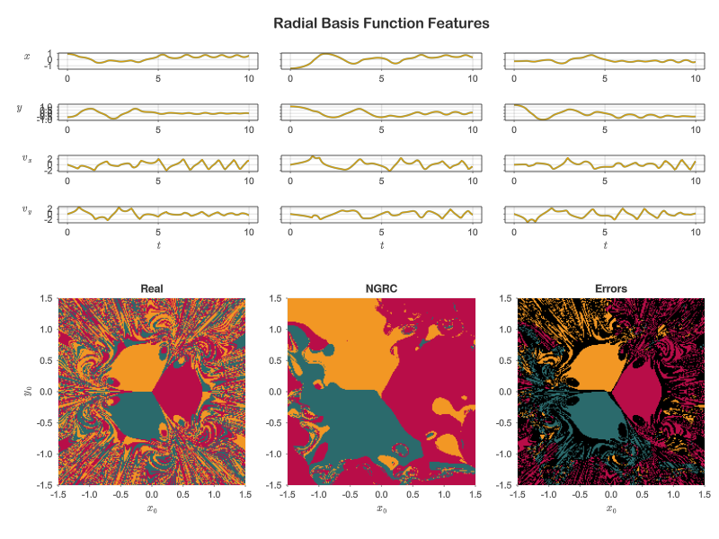

# NextGenRCBasins
`NextGenRCBasins` is a Julia package that implements the [Next Generation Reservoir Computing](https://www.nature.com/articles/s41467-021-25801-2) (NGRC) framework for data-driving learning of dynamical systems, and applies it to the problem of predicting [basins of attraction](https://www.scholarpedia.org/article/Basin_of_attraction) in the [Magnetic Pendulum](https://ima.org.uk/13908/chaos-in-the-magnetic-pendulum/) system. 

# Overview
This package defines methods to train and simulate NGRC models from time series data, and implements the magnetic pendulum dynamics (see `MagneticPendulum`). It also includes utility functions for mapping the basins of attraction according to either the real Magnetic Pendulum ODEs or a trained NGRC model in parallel using multiple CPUs.

# System Requirements
## Hardware requirements
`NextGenRCBasins` requires only a standard computer with sufficient RAM to store and operate on 
training data sets of the specified size.

## Software Requirements

### Operating System
This package is designed to work on all platforms on which [Julia](https://julialang.org/downloads/) and all dependencies (below) can be installed. It has been tested on the following platforms using Julia 1.8.2:
* macOS: Monterey (12.3.1)
* Linux: Ubuntu (20.04, "Focal Fossa") 

### Julia dependencies
This package and demo script rely on the Julia packages listed in the [Project.toml](Project.toml) file. All are available via Julia's [General Registry](https://github.com/JuliaRegistries/General) using `Pkg`.


# Installation Guide
Clone this repository, enter the working directory, and start Julia:
```bash
git clone git@github.com:spcornelius/NextGenRCBasins.git
cd NextGenRCBasins
julia --project
```

Then within julia, instantiate the project (install all dependencies)

```julia
julia> using Pkg
julia> Pkg.instantiate()
```

Depending on your computer, installing and precompiling all dependencies may take approximately 10 minutes.

# Demo
This package contains a [demo script](scripts/example.jl) that demonstrates training and prediction of different NGRC models on the Magnetic Pendulum system. Specifically, the demo 
does the following:
- Generates training data (trajectories) from 100 randomly-chosen initial conditions of the Magnetic Pendulum system
- Trains three different NGRC models on the data, each one employing a different type of nonlinear feature embedding:
    - Polynomials (up to order 3 by default, see `PolynomialFeatures`)
    - Radial Basis Functions (100 by default, see `RadialBasisFeatures`)
    - The exact Magnetic Pendulum nonlinearities (see `ExactMagneticPendulumFeatures`)
- Calculates the basin of attraction of the magnetic pendulum according to the real ODEs and vs each trained NGRC model

## How to run
To run the demo, first open the Julia REPL:

```bash
julia --project
```

...then include the demo script:

```julia
julia> include("scripts/example.jl)
```

## Expected run time
The most time consuming part of the demo is the basin computation for the real system and the three NGRC models. This script automatically parallelizes said computations over the available CPU cores on your system.  On an 8-core Intel Core i9 (3.9 Ghz)-based iMac, running the demo script from start to finish takes approximately 14 minutes.

## Expected output
The demo will produce three plots, one for each trained NGRC model. Each plot shows a sample of three (of the 100) of the training trajectories and the corresponding NGRC model fits. It also shows a color-coded map of the basins of attraction of the real system vs. the basins predicted by the given NGRC model, and highlights any initial conditions that were mis-classified. An example output for the `RadialBasisFeatures` NGRC model appears below:



Note: because the training initial conditions are chosen randomly, your output may look different, but should appear qualitiatively similar. Specifically, the training fits should be excellent for all models. But the NGRC-predicted basin map will be a poor match to the real system(except for the `ExactMagneticPendulumFeatures` model)
